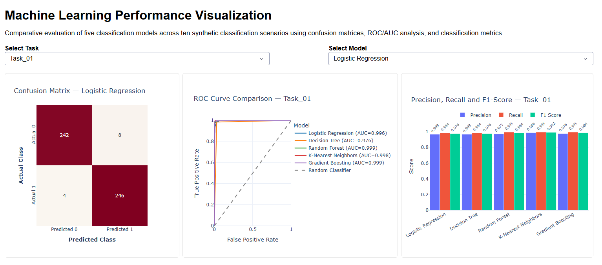
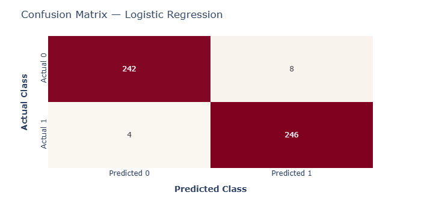
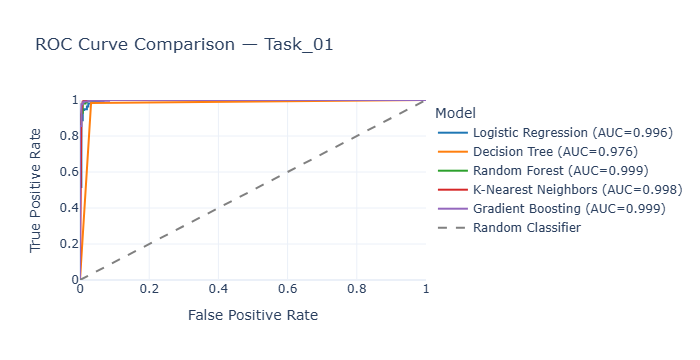
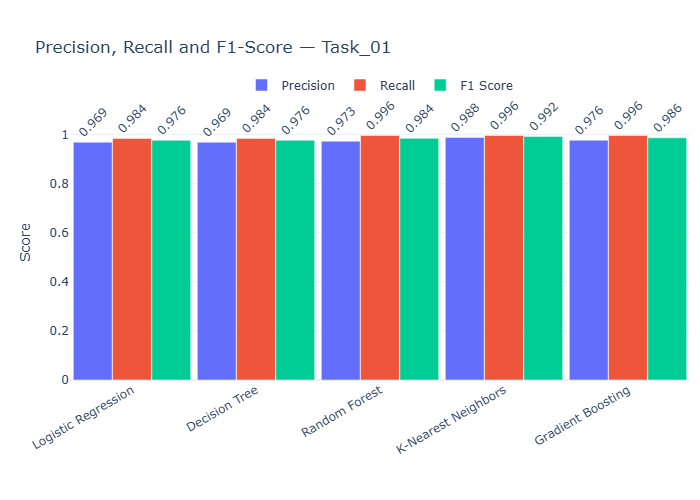

# Machine Learning Performance Visualization

### Interactive Model Evaluation Across Synthetic Classification Scenarios

An end-to-end machine learning analytics project that evaluates **five classification algorithms across ten controlled synthetic classification scenarios** and translates model performance into an interactive **Plotly Dash dashboard**.

The project combines experimental design, machine learning evaluation, analytical visualization, and decision-oriented interpretation to demonstrate how model performance changes under **class imbalance, label noise, feature complexity, and class overlap**.

---

## Dashboard Preview

<p align="center">
  
</p>

The interactive dashboard enables users to select a classification task and model while exploring **confusion matrices, ROC/AUC curves, Precision, Recall, and F1 Score**.

---

## Business Problem

Selecting a classification model based on a single performance metric can produce misleading conclusions.

Model effectiveness can change substantially when datasets contain:

- Class imbalance
- Label noise
- Strong class overlap
- High-dimensional feature spaces
- Redundant or uninformative features

This project builds a controlled evaluation framework to answer:

> **Which classification models remain most robust as data conditions become more challenging?**

Rather than optimizing for one isolated score, the analysis compares models across multiple performance dimensions and synthetic operating conditions.

---

## Experimental Design

| Component | Design |
|---|---|
| Classification Tasks | 10 synthetic binary classification scenarios |
| Observations | 2,000 per task |
| Models | 5 classification algorithms |
| Train/Test Split | 75% / 25% stratified |
| Model-Task Evaluations | 50 |
| Test Predictions | 25,000 |
| Evaluation Metrics | Accuracy, Precision, Recall, F1 Score, ROC-AUC |
| Diagnostic Analysis | Confusion Matrices and ROC Curves |

Synthetic datasets were generated with Scikit-learn's `make_classification`. Within each task, all five models received the **same dataset and identical train/test split**, enabling controlled model comparison.

The ten scenarios deliberately vary characteristics such as class separation, label noise, class imbalance, dimensionality, and redundant features.

---

## Models Evaluated

1. **Logistic Regression**
2. **Decision Tree**
3. **Random Forest**
4. **K-Nearest Neighbors**
5. **Gradient Boosting**

Scaling pipelines were applied where appropriate, while every selected classifier supports probability-based evaluation for ROC/AUC analysis.

---

## Performance Evaluation

<table>
<tr>
<td width="50%" align="center">
  
  <br>
  <b>Confusion Matrix</b>
</td>
<td width="50%" align="center">
  
  <br>
  <b>ROC / AUC Comparison</b>
</td>
</tr>
</table>

<p align="center">
  
</p>

<p align="center">
  <b>Precision, Recall & F1 Score Comparison</b>
</p>


### Why multiple metrics?

**Accuracy** provides overall correctness but may hide weaknesses under class imbalance.

**Precision** measures how reliably positive predictions are correct.

**Recall** measures the model's ability to identify positive cases.

**F1 Score** balances Precision and Recall and was used as the primary metric for overall comparison.

**ROC-AUC** evaluates discrimination capability across classification thresholds.

**Confusion matrices** expose the underlying false-positive and false-negative error structure.

---

## Key Findings

### Random Forest — Strongest Overall Model

Random Forest achieved the strongest aggregate performance across the ten synthetic scenarios:

- **Average Accuracy:** 0.937
- **Average Precision:** 0.935
- **Average Recall:** 0.913
- **Average F1 Score:** **0.922**
- **Average ROC-AUC:** **0.964**
- Best-performing model in **6 of 10 tasks**

### K-Nearest Neighbors — Strongest Alternative

K-Nearest Neighbors demonstrated competitive performance:

- **Average Accuracy:** 0.922
- **Average Precision:** 0.922
- **Average Recall:** 0.896
- **Average F1 Score:** **0.908**
- **Average ROC-AUC:** 0.947
- Best-performing model in **4 of 10 tasks**

### Most Challenging Scenario — Task_10

The combined difficult scenario produced the weakest average model performance:

- **Average Accuracy:** 0.771
- **Average Precision:** 0.752
- **Average Recall:** 0.588
- **Average F1 Score:** **0.657**
- **Average ROC-AUC:** **0.803**

Task_10 combines stronger class overlap, label noise, class imbalance, and feature complexity, demonstrating how multiple data-quality challenges can materially reduce classification performance.

> **Key takeaway:** Ensemble methods provided the strongest overall robustness in these controlled synthetic experiments, while model performance declined substantially when multiple classification challenges were introduced simultaneously.

---

## Overall Model Comparison

| Model | Avg. Accuracy | Avg. Precision | Avg. Recall | Avg. F1 | Avg. AUC |
|---|---:|---:|---:|---:|---:|
| **Random Forest** | **0.937** | **0.935** | **0.913** | **0.922** | **0.964** |
| K-Nearest Neighbors | 0.922 | 0.922 | 0.896 | 0.908 | 0.947 |
| Gradient Boosting | 0.923 | 0.919 | 0.898 | 0.906 | 0.958 |
| Decision Tree | 0.862 | 0.839 | 0.842 | 0.840 | 0.858 |
| Logistic Regression | 0.855 | 0.838 | 0.826 | 0.829 | 0.892 |

---

## Interactive Dashboard

The dashboard was developed with **Plotly Dash** to convert model evaluation results into an interactive analytical interface.

### Dashboard Components

- **Model Selector** — changes the selected model for confusion-matrix analysis
- **Task Selector** — explores performance across synthetic scenarios
- **Confusion Matrix Heatmap** — visualizes TP, TN, FP, and FN outcomes
- **ROC Curve Comparison** — compares all five models with AUC values
- **Performance Metrics Chart** — compares Precision, Recall, and F1 Score across models

Consistent model colors and controlled chart formatting improve comparison and visual interpretation.

---

## Project Workflow

```text
Synthetic Scenario Design
          │
          ▼
Scikit-learn make_classification
          │
          ▼
Stratified Train/Test Split
          │
          ▼
Five Classification Models
          │
          ▼
Predictions + Probabilities
          │
          ▼
Accuracy │ Precision │ Recall │ F1 │ ROC-AUC
          │
          ▼
Confusion Matrices + ROC Curves
          │
          ▼
Analytical Comparison
          │
          ▼
Interactive Plotly Dash Dashboard
          │
          ▼
Decision-Oriented Insights
```

---

## Technology Stack

| Technology | Application |
|---|---|
| **Python** | End-to-end analytical workflow |
| **Pandas** | Data manipulation and performance summaries |
| **NumPy** | Numerical operations |
| **Scikit-learn** | Synthetic data generation, ML models, metrics and ROC analysis |
| **Plotly** | Interactive analytical visualizations |
| **Dash** | Interactive dashboard application |
| **Jupyter** | Reproducible analysis and documentation |

---

## Repository Contents

```text
Machine_Learning_Performance_Visualization/
│
├── ML_Performance_Visualization.ipynb
├── ML_Performance_Dashboard.png
├── ML_Performance_Visualization_Demo.mp4
├── ML_Performance_Visualization_Presentation.pptx
├── Confusion_Matrix.png
├── ROC_Curve_Comparison.png
├── Model_Performance_Metrics.png
└── README.md
```

---

## Recommendations & Next Steps

Based on the synthetic experiments, future iterations could:

- Perform systematic **hyperparameter optimization**
- Apply **class weighting or resampling** for imbalanced scenarios
- Tune classification thresholds to manage the **Precision–Recall trade-off**
- Evaluate **feature selection and dimensionality reduction**
- Add cross-validation and uncertainty estimates for stronger model comparison
- Validate the evaluation framework on **real-world datasets before deployment**
- Package and deploy the Dash application for browser-based access

---

## Project Impact

This project demonstrates an end-to-end approach to **machine learning performance analytics**—from controlled data simulation and model evaluation to interactive visualization and analytical communication.

The framework covers **50 controlled model-task experiments** and converts confusion matrices, ROC/AUC analysis, and classification metrics into decision-ready performance insights.

### Skills Demonstrated

`Machine Learning` · `Model Evaluation` · `Classification` · `Python` · `Scikit-learn` · `Data Visualization` · `Plotly` · `Dash` · `ROC/AUC Analysis` · `Confusion Matrices` · `Analytical Storytelling` · `Interactive Dashboard Development`

---

## Important Note

All datasets used in this project are **synthetically generated**. Findings represent controlled experimental comparisons and should **not be interpreted as evidence that one algorithm will universally outperform another on real-world data**.

Model selection in production should incorporate domain requirements, validation data, business costs, explainability, latency, operational constraints, and deployment conditions.

---

## Author

**Usman Ali**

Data Analytics & Machine Learning Portfolio

GitHub: `https://github.com/usmanali9999`

---

<p align="center">
  <b>From model predictions to decision-ready performance insights.</b>
</p>
